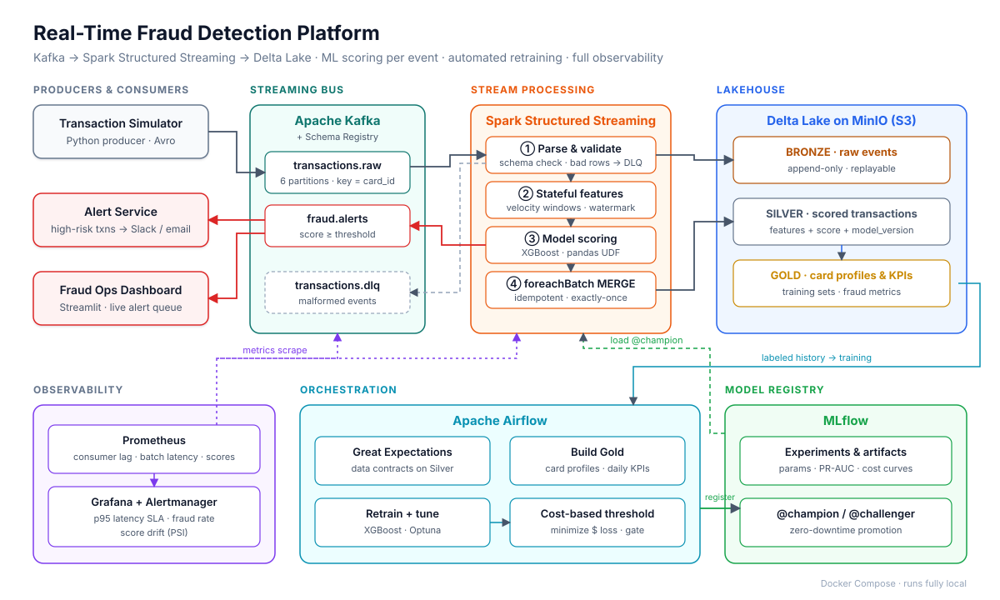
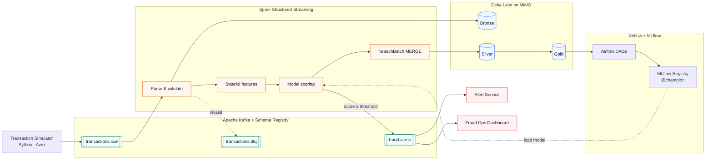
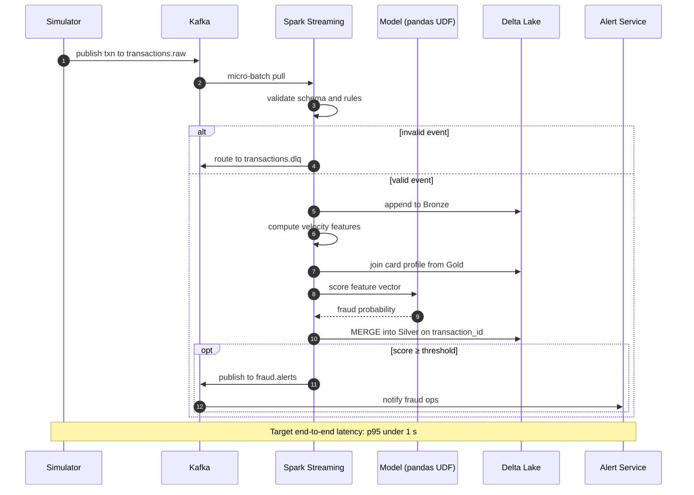
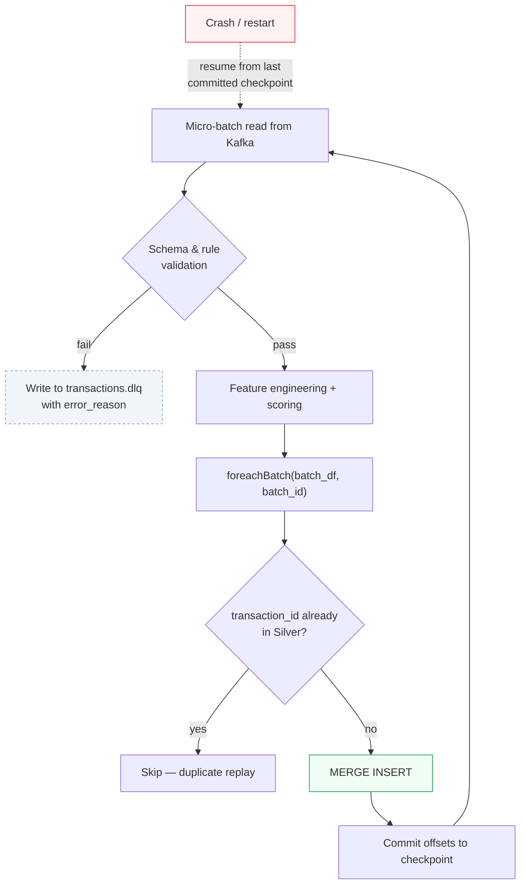
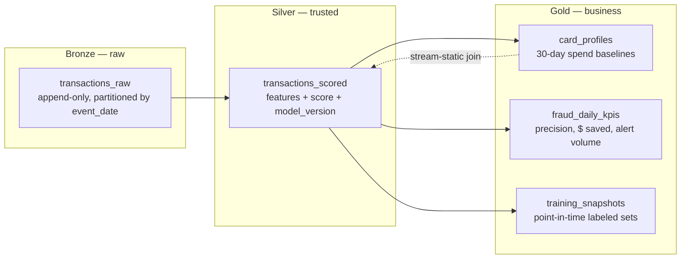
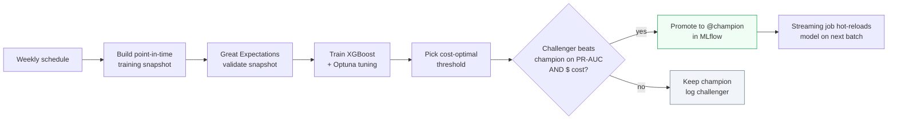

<div align="center">

#  Fraud Detection Platform

**Score every card transaction in under a second, stop fraud before it settles, and retrain the model automatically as fraud patterns shift.**




</div>

---

##  Table of Contents

- [The Problem](#-the-problem)
- [What This Platform Does](#-what-this-platform-does)
- [Architecture](#-architecture)
- [Transaction Lifecycle](#-transaction-lifecycle)
- [Exactly-Once & Failure Handling](#-exactly-once--failure-handling)
- [Lakehouse Design](#-lakehouse-design)
- [Feature Engineering](#-feature-engineering)
- [Model & Cost-Based Thresholding](#-model--cost-based-thresholding)
- [Automated Retraining](#-automated-retraining)
- [Observability](#-observability)
- [Results](#-results)
- [Tech Stack](#-tech-stack)
- [Repository Structure](#-repository-structure)
- [Getting Started](#-getting-started)
- [Testing](#-testing)
- [Design Decisions](#-design-decisions)
- [Roadmap](#-roadmap)
- [Acknowledgments](#-acknowledgments)

---

##  The Problem

Card issuers have a few hundred milliseconds between a swipe and an authorization decision. Batch fraud models that run overnight catch fraud **after** the money is gone. A useful system has to:

1. **Decide in real time.** Score each transaction as it arrives, not hours later.
2. **Optimize for money, not accuracy.** Missing a $2,000 fraud costs far more than a false alert on a $5 coffee.
3. **Never double-count or drop a transaction.** Regulators and finance teams need exact numbers.
4. **Keep up with fraudsters.** Patterns drift, so the model has to be monitored and retrained without downtime.

##  What This Platform Does

| Capability | How it's done |
| --- | --- |
|  Real-time scoring | Kafka → Spark Structured Streaming → XGBoost scoring via pandas UDF |
|  Stateful features | Sliding-window velocity features with watermarks + stream-static join to card profiles |
|  Exactly-once delivery | Spark checkpoints + idempotent `MERGE` on `transaction_id` inside `foreachBatch` |
|  Fault isolation | Malformed events routed to a dead-letter topic instead of crashing the stream |
|  Lakehouse | Bronze / Silver / Gold Delta tables on S3-compatible MinIO |
|  Data contracts | Great Expectations suites gate every Silver partition |
|  Business-aware decisions | Alert threshold chosen to minimize expected dollar loss |
|  Automated retraining | Airflow DAG: train → tune → evaluate → champion/challenger promotion in MLflow |
|  Observability | Prometheus + Grafana: consumer lag, p95 latency SLA, fraud rate, score drift (PSI) |

---

##  Architecture



**Kafka topics**

| Topic | Partitions | Key | Purpose |
| --- | --- | --- | --- |
| `transactions.raw` | 6 | `card_id` | Incoming transactions (Avro, schema-registered) |
| `fraud.alerts` | 3 | `card_id` | Transactions scored above the decision threshold |
| `transactions.dlq` | 1 | none | Events that failed schema or business-rule validation |

> Keying by `card_id` keeps every card's transactions on one partition, so windowed features see events in order.

---

## Transaction Lifecycle



---

## Exactly-Once & Failure Handling

Streaming systems usually fail in two ways: they **lose** events or **duplicate** them on restart. This pipeline handles both.



- **Checkpointing:** Kafka offsets and window state are stored in a checkpoint directory on MinIO, so a restart resumes exactly where it stopped.
- **Idempotent sink:** `MERGE ... WHEN NOT MATCHED THEN INSERT` on `transaction_id` means a replayed batch can't create duplicates.
- **Dead-letter queue:** bad events are kept with an `error_reason` for inspection and replay, never silently dropped.
- **Late data:** a watermark (default 10 minutes) bounds state size while still accepting slightly late events.

---

## Lakehouse Design



| Layer | Table | Written by | Notes |
| --- | --- | --- | --- |
| Bronze | `transactions_raw` | Streaming job | Exact copy of Kafka payload + ingest metadata; supports full replay |
| Silver | `transactions_scored` | Streaming job (`MERGE`) | One row per transaction; validated by Great Expectations |
| Gold | `card_profiles` | Airflow daily | Per-card spend baselines used as streaming features |
| Gold | `fraud_daily_kpis` | Airflow daily | Business metrics for the dashboard |
| Gold | `training_snapshots` | Airflow weekly | Point-in-time correct training data (no label leakage) |

---

## Feature Engineering

| Feature | Type | Computed in | Why it matters |
| --- | --- | --- | --- |
| `txn_count_10m`, `txn_count_1h` | Velocity | Streaming window | Card-testing attacks fire many small transactions quickly |
| `amount_sum_1h` | Velocity | Streaming window | Sudden spend bursts |
| `amount_zscore` | Behavioral | Stream-static join | Amount relative to the card's own 30-day baseline |
| `secs_since_last_txn` | Behavioral | Streaming state | Impossible-travel and rapid-fire patterns |
| `distance_from_home_km` | Geo | Stream-static join | Transactions far from the cardholder's usual area |
| `is_new_merchant` | Behavioral | Stream-static join | First-time merchant for this card |
| `merchant_category_risk` | Categorical | Gold lookup | Historical fraud rate of the merchant category |
| `hour_of_day`, `is_weekend` | Temporal | Streaming | Fraud skews toward unusual hours |

> **Training/serving parity:** the same feature functions live in `src/features/` and are imported by both the streaming job and the training DAG, so offline and online features can't drift apart.

---

## Model & Cost-Based Thresholding

- **Model:** XGBoost with `scale_pos_weight` for heavy class imbalance, tuned with Optuna.
- **Primary metric:** PR-AUC (ROC-AUC is misleading when fraud is a tiny fraction of transactions).
- **Decision threshold:** instead of the default 0.5, the threshold minimizes expected business cost:

$$
\text{Cost}(t) = \sum_{\text{missed fraud}} \text{amount}_i \;+\; N_{\text{false alerts}}(t) \times C_{\text{review}}
$$

where $C_{\text{review}}$ is the analyst cost of investigating one alert (configurable in `config/model.yaml`).

- **Explainability:** SHAP values are logged per model version, and the top contributing features are attached to every alert so analysts can see *why* a transaction was flagged.

---

## Automated Retraining



**Airflow DAGs**

| DAG | Schedule | What it does |
| --- | --- | --- |
| `dq_silver_validation` | Hourly | Runs Great Expectations on new Silver partitions; alerts on failure |
| `build_gold` | Daily | Refreshes `card_profiles` and `fraud_daily_kpis` |
| `retrain_fraud_model` | Weekly + on drift alert | Trains, evaluates, and promotes a challenger if it wins |

> The streaming job checks the MLflow `@champion` alias at the start of each micro-batch and swaps models with **zero downtime**. No restart needed.

---

## Observability

| Dashboard panel | Metric | Alert rule |
| --- | --- | --- |
| Throughput | Events/sec in and out | Drop > 50% for 5 min |
| Consumer lag | Kafka lag per partition | Lag > 10k messages |
| Latency SLA | p50 / p95 / p99 end-to-end latency | p95 > 1 s for 5 min |
| Fraud rate | % of transactions alerted | Outside 3σ of 7-day mean |
| Score drift | Population Stability Index vs. training | PSI > 0.2 → triggers retraining DAG |
| DLQ volume | Malformed events/min | Any sustained spike |

<!-- Add a Grafana screenshot once it's running: -->
<!--  -->

---

## Results

> Fill these in from your own runs. Every number here should be reproducible with `make benchmark`.

| Metric | Value |
| --- | --- |
| Sustained throughput | `___` events/sec |
| End-to-end latency (p95) | `___` ms |
| PR-AUC (test set) | `___` |
| Recall at chosen threshold | `___` % |
| Precision at chosen threshold | `___` % |
| Expected cost vs. default 0.5 threshold | `___` % lower |
| Duplicates after forced restart test | `0` |

---

## Tech Stack

| Layer | Tools |
| --- | --- |
| Ingestion | Apache Kafka, Confluent Schema Registry, Avro |
| Stream processing | Apache Spark 3.5 Structured Streaming (PySpark) |
| Storage | Delta Lake, MinIO (S3-compatible) |
| ML | XGBoost, Optuna, SHAP, scikit-learn |
| Model registry | MLflow |
| Orchestration | Apache Airflow |
| Data quality | Great Expectations |
| Observability | Prometheus, Pushgateway, Grafana, Alertmanager |
| Serving / UI | Streamlit, Python alert consumer |
| Infra & CI | Docker Compose, GitHub Actions, pytest |

---

## Repository Structure

```
realtime-fraud-detection/
├── docker-compose.yml
├── Makefile
├── config/
│   ├── model.yaml              # review cost, threshold search range
│   └── streaming.yaml          # watermark, trigger interval, topics
├── producer/
│   ├── simulator.py            # synthetic transaction generator
│   └── schemas/transaction.avsc
├── src/
│   ├── features/               # shared feature logic (stream + batch)
│   ├── streaming/
│   │   ├── fraud_stream.py     # main Structured Streaming job
│   │   └── sinks.py            # foreachBatch MERGE + DLQ writer
│   ├── models/
│   │   ├── train.py
│   │   ├── threshold.py        # cost-based threshold search
│   │   └── registry.py         # MLflow champion/challenger logic
│   └── monitoring/metrics.py   # Prometheus custom metrics, PSI
├── airflow/dags/
│   ├── dq_silver_validation.py
│   ├── build_gold.py
│   └── retrain_fraud_model.py
├── great_expectations/
├── consumers/
│   ├── alert_service.py
│   └── dashboard.py            # Streamlit app
├── monitoring/
│   ├── prometheus.yml
│   └── grafana/dashboards/fraud.json
├── tests/
│   ├── unit/
│   └── integration/
└── docs/
    └── architecture.svg
```

---

## Getting Started

### Prerequisites

- Docker + Docker Compose (allocate **≥ 8 GB RAM** to Docker)
- Python 3.11
- `make`

### Run it

```bash
# 1. Clone
git clone https://github.com/<your-username>/realtime-fraud-detection.git
cd realtime-fraud-detection

# 2. Start Kafka, Spark, MinIO, Airflow, MLflow, Prometheus, Grafana
make up

# 3. Train and register the first model
make train

# 4. Start the streaming job
make stream

# 5. Start producing transactions (default 500 events/sec)
make produce RATE=500
```

### Service URLs

| Service | URL |
| --- | --- |
| Kafka UI | http://localhost:8088 |
| Spark UI | http://localhost:4040 |
| MinIO console | http://localhost:9001 |
| Airflow | http://localhost:8080 |
| MLflow | http://localhost:5000 |
| Grafana | http://localhost:3000 |
| Fraud Ops Dashboard | http://localhost:8501 |

### Tear down

```bash
make down        # stop services
make clean       # stop + delete volumes and checkpoints
```

---

## Testing

```bash
make test              # unit tests (feature logic, threshold search, PSI)
make test-integration  # spins up Kafka + Spark, pushes events, asserts Silver row counts
make chaos             # kills the streaming job mid-run, restarts it, asserts zero duplicates
```

The **chaos test** is the proof of exactly-once: it produces a known number of transactions, force-kills Spark partway through, restarts it, and checks that Silver contains exactly that many unique rows.

CI runs unit tests, linting (`ruff`), and type checks (`mypy`) on every pull request via GitHub Actions.

---

## Design Decisions

<details>
<summary><b>Why Spark Structured Streaming instead of Flink?</b></summary>

Sub-second micro-batches meet the latency target, and Spark lets the same feature code run in streaming and batch training. That shared code is what guarantees training/serving parity. Flink would be the choice for single-digit-millisecond latency.
</details>

<details>
<summary><b>Why MERGE instead of plain append for Silver?</b></summary>

Appends are fast but duplicate rows whenever a batch is replayed after a failure. `MERGE` on `transaction_id` makes the write idempotent, which is what turns at-least-once delivery into effectively exactly-once results.
</details>

<details>
<summary><b>Why a cost-based threshold?</b></summary>

Accuracy is meaningless when fraud is rare: a model that never flags anything can still look 99%+ accurate. Tying the threshold to dollar loss and analyst review cost makes the model's decisions match what the business actually cares about.
</details>

<details>
<summary><b>Why Delta Lake on MinIO?</b></summary>

ACID writes, `MERGE`, and time travel on cheap object storage. MinIO is S3-compatible, so moving to AWS S3 is a config change, not a rewrite.
</details>

---

## Roadmap

- [ ] Deploy on AWS (MSK + EMR Serverless + S3) with Terraform
- [ ] Replace XGBoost with a sequence model (e.g., a tabular transformer) over each card's recent history
- [ ] Graph features linking cards, devices, and merchants to catch fraud rings
- [ ] Feature store (Feast) with Redis for single-digit-ms online lookups
- [ ] Analyst feedback loop: confirmed/false alerts flow back as labels

---

\
